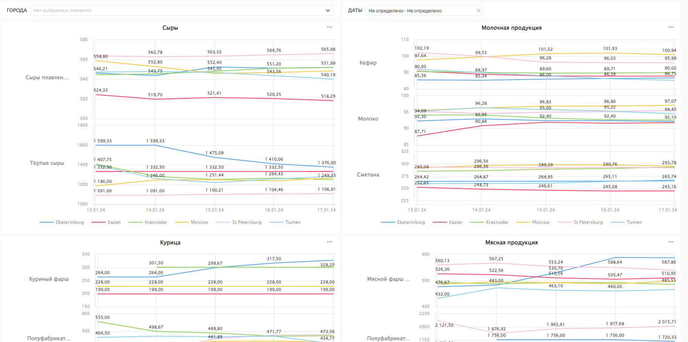
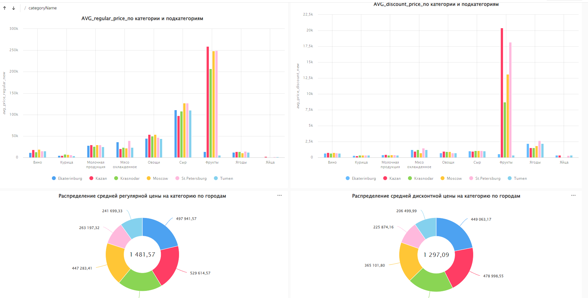

# PROJECT BIG DATA 2023 

## Описание проекта
Проект выполнен для курса BID DATA . 
В качестве данных использовались данные магазина ЛЕНТА. 
Был написан асинхронный парсинг, используя API приложение LENTA.COM , что помогло  ускорить загрузку данных . 
Далее данные с помощью SPARK кладутся на кластер и обрабатываются для дальнешего анализа. Агрегация данных так же происходит с помощью SPARK.
Следующим этапом данные переносятся в базу данных SQL и строятся дашбоды в DATALENS.

Так же был написан телеграммбот. С помощью него можно увидеть цену на тот или иной товар и имея данные о средней зарплате в регионе - понять какая доля от ЗП состаляет стоимость прлуктовой корзины вс среднем для потребителя. 

## Практическое приложение проекта
Можно увидеть как меняются цены на категории и сабкатегории продуктов по городам в течении времени. И имея данныt об изменении спроса на товары- понмимать , какая дисконтная цена наиболее выгодна.
Так же можно сравнивать цены на товары по городам- как регулярные , так и дисконтные и между собой . 

## Ссылка на дашборд в DATALENS
https://datalens.yandex.ru/vpfjj8eaw2gaj-lenta-shop-1

## Примеры дашбордов

